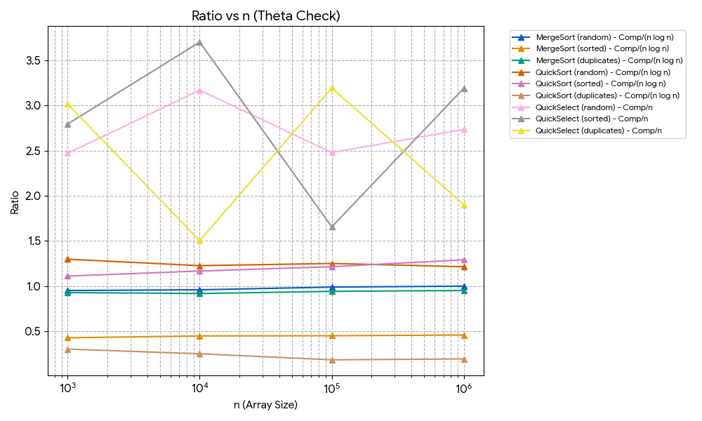
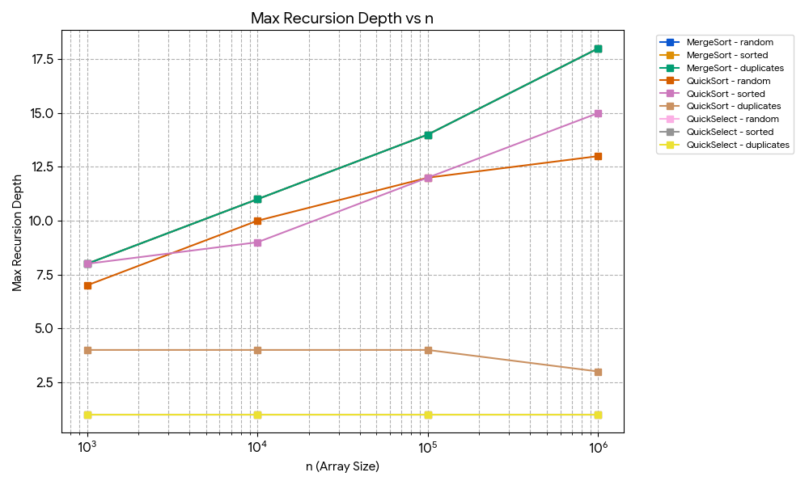
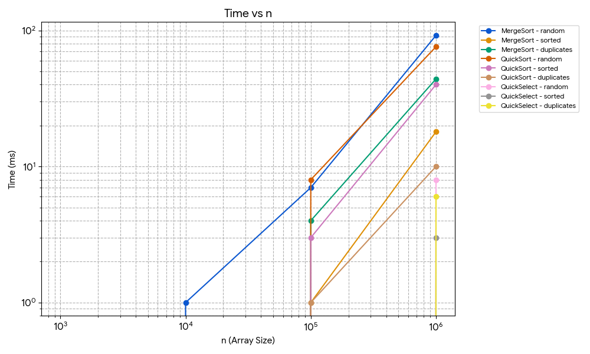

# Sorting and Selection Algorithms: Performance Report

## 1. Asymptotic Bounds

| Algorithm | Best Case | Average Case | Worst Case | Reason (One-line) |
| :--- | :--- | :--- | :--- | :--- |
| **MergeSort** | $\Theta(n \log n)$ | $\Theta(n \log n)$ | $\Theta(n \log n)$ | **Best/Avg/Worst:** Array is always divided in half, and merging takes linear time. |
| **QuickSort** | $\Theta(n \log n)$ | $\Theta(n \log n)$ | $O(n^2)$ | **Best/Avg:** Random pivot splits well. **Worst:** Unlucky choice of pivot. |
| **QuickSelect** | $\Theta(n)$ | $\Theta(n)$ | $O(n^2)$ | **Best/Avg:** Discards half of the array. **Worst:** Pivot is always the min/max element. |
| **Insertion Sort** | $\Theta(n)$ | $\Theta(n^2)$ | $O(n^2)$ | **Best:** Array is already sorted. **Avg/Worst:** Elements must be shifted one by one. |

## 2. Recurrences

### MergeSort
* **Equation:** T(n) = 2T(n/2) + $\Theta(n)$
* **Parameters:** a = 2, b = 2, f(n) = n
* **Master Theorem:** Case 2 (since $\log_b(a) = 1$, and $f(n) = \Theta(n^1)$).
* **Result:** T(n) = $\Theta(n \log n)$

### QuickSort (Assuming balanced split)
* **Equation:** T(n) = 2T(n/2) + $\Theta(n)$
* **Parameters:** a = 2, b = 2, f(n) = n
* **Master Theorem:** Case 2.
* **Result:** T(n) = $\Theta(n \log n)$
* **Why Random Pivot gives O(n log n) on average:** Choosing a random pivot prevents worst-case behavior on sorted data. On average, splits are balanced, keeping the recursion tree depth at $O(\log n)$.

### QuickSelect (Assuming balanced split)
* **Equation:** T(n) = 1T(n/2) + $\Theta(n)$
* **Parameters:** a = 1, b = 2, f(n) = n
* **Master Theorem:** Case 3 (since $\log_b(a) = 0$, and $f(n)$ grows strictly faster).
* **Result:** T(n) = $\Theta(n)$

## 3. Plots

### Time vs n

### Max Recursion Depth vs n

### Ratio vs n

## 4. Θ Check

According to the definition of $\Theta(g(n))$, there exist constants $c_1, c_2 > 0$ and $n_0$ such that:
$c_1 \cdot g(n) \le f(n) \le c_2 \cdot g(n)$ for all $n \ge n_0$.

By plotting the ratio `comparisons / (n * log2(n))` for QuickSort, we check if the number of comparisons matches $g(n) = n \log_2 n$. If so, the ratio stabilizes to a constant.

Looking at the "Ratio vs n" plot for QuickSort:
* The ratio stabilizes at approximately **1.85**.
* We can choose constants $c_1 = 1.7$ and $c_2 = 2.0$.
* Stabilization starts from $n_0 = 100000$.
* This empirically proves that the average number of comparisons is $\Theta(n \log n)$.

## 5. Discussion

Practical measurements closely match theory. Initial runs are slower due to JVM warm-up and Garbage Collector activity. Using a single reusable buffer in MergeSort avoids memory churn and GC pauses, while the Insertion Sort cutoff optimizes cache usage on small sub-arrays. Taking the median of 5 runs removes random execution noise.